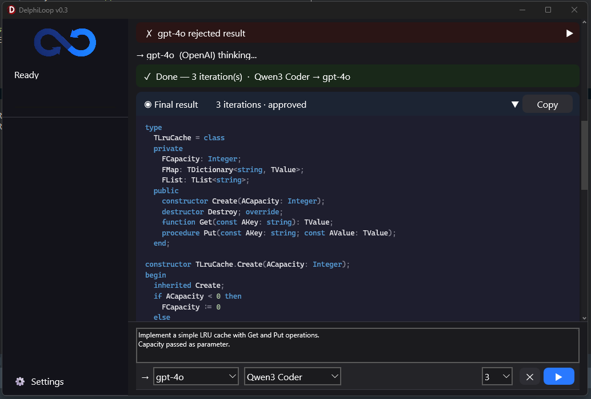

# DelphiLoop

> An AI-powered code generation agent built entirely in Delphi.  
> Two models. One loop. Clean code or keep trying.


---

## What is DelphiLoop?

DelphiLoop is a desktop application that runs an agentic **generate → review → refine** loop using two AI models simultaneously.

You write a task. The **Executor** model generates Delphi code. The **Reviewer** model inspects it for bugs, memory leaks, logic errors, and bad practices. If issues are found, the Executor fixes them. This continues until the Reviewer says `NO_ISSUES` — or the iteration limit is reached.

It works with local models via **Ollama** and cloud models via **OpenAI** (or any OpenAI-compatible API). You can mix and match — local executor, cloud reviewer, or the other way around.

---

## Screenshots



---

## Features

- **Agentic loop** — generate → review → refine, up to N iterations
- **Two independent agents** — Executor writes, Reviewer criticizes
- **Multi-provider support** — Ollama, OpenAI, any OpenAI-compatible endpoint
- **Model mixing** — local + cloud, any combination
- **Persistent XML config** — providers, models, and settings saved between sessions
- **Settings UI** — add/edit/remove providers and models without touching config files
- **Token counter** — tracks tokens used and estimated cost per session
- **Resizable layout** — drag the splitter to adjust task input vs output area
- **Copy to clipboard** — one click to grab the generated code
- **Clear log** — cleans up the log between runs

---

## How It Works

```
┌─────────────────────────────────────────────────────┐
│                     Your Task                       │
└───────────────────────┬─────────────────────────────┘
                        │
                        ▼
              ┌─────────────────┐
              │    EXECUTOR     │  ← writes code
              │  (any model)    │
              └────────┬────────┘
                       │ code
                       ▼
              ┌─────────────────┐
              │    REVIEWER     │  ← finds issues
              │  (any model)    │
              └────────┬────────┘
                       │
              ┌────────┴────────┐
              │                 │
           NO_ISSUES         issues found
              │                 │
              ▼                 ▼
           DONE ✓         back to EXECUTOR
                          (with review notes)
```

The loop runs in a background thread. The UI stays responsive throughout. All events flow back to the form via callbacks — the engine knows nothing about buttons or labels.

---

## Architecture

DelphiLoop is intentionally structured so the engine is decoupled from the UI.

```
DelphiLoop.dpr
│
├── uMain.pas / uMain.dfm     ← UI only, subscribes to engine events
│
├── LoopEngine.pas            ← All agent logic, HTTP, JSON parsing
│                               Communicates via callbacks only
│
├── LoopConfig.pas            ← TLoopConfig (data) + TLoopConfigIO (XML)
│                               Uses TList<T> generics
│
├── LoopTypes.pas             ← TProviderConfig, TModelConfig, TProviderType
│
└── LoopConsts.pas            ← All strings, prompts, pricing constants
```

### Engine Callbacks

The engine fires these events (all marshalled to the main thread via `TThread.Synchronize`):

| Event | When |
|---|---|
| `OnLog` | Every log message |
| `OnProgress` | Progress bar update |
| `OnStatus` | Status bar message |
| `OnIter` | Iteration status label |
| `OnDone` | Loop finished successfully |
| `OnError` | Exception during loop |
| `OnTokens` | Tokens used + estimated cost |

Because the engine only knows about callbacks, the same `LoopEngine` can run in a console application, a service, or an FMX Android app — just replace `uMain`.

---

## Prompts

All prompts live in `LoopConsts.pas` and can be tuned without touching logic:

**Executor prompt:**
```
You are a senior Delphi developer.
Write clean, compilable Delphi code for the task below.
Do NOT add features not mentioned in the task.
Reply with Delphi code ONLY. No markdown, no explanation.
```

**Reviewer prompt:**
```
You are a strict Delphi code reviewer.
Check ONLY: bugs, memory leaks, logic errors, compilation errors, bad practices.
Do NOT suggest new features, thread safety, or anything not required by the original task.
Be specific — reference exact line or method names.
If code correctly implements the task with no bugs, reply with exactly: NO_ISSUES
```

**Refine prompt:**
```
You are a senior Delphi developer.
Fix ONLY the issues listed in the review below.
Do NOT add new features or change working code.
Reply with corrected Delphi code ONLY. No markdown.
```

---

## Getting Started

### Requirements

- **RAD Studio** 11 Alexandria or newer (tested on RAD Studio 13 Florence)
- **Windows** 10/11
- **Ollama** (optional, for local models) — [ollama.com](https://ollama.com)
- **OpenAI API key** (optional, for cloud models)

### Build

1. Clone the repository
2. Open `DelphiLoop.dpr` in RAD Studio
3. Build (`Shift+F9`)
4. Run

No third-party components. No GetIt packages. Pure VCL.

### First Run

On first launch, DelphiLoop creates a default `DelphiLoop.xml` config file next to the executable with two providers and four models pre-configured:

**Providers:**
- `Ollama (local)` — `http://localhost:11434`
- `OpenAI` — `https://api.openai.com`

**Models:**
- `qwen2.5-coder:7b` (Ollama)
- `llama3.1:8b` (Ollama)
- `gpt-4o` (OpenAI)
- `gpt-4o-mini` (OpenAI)
- `gpt-5` (OpenAI)

To use OpenAI models, open **Settings** and edit the OpenAI provider to add your API key.

---

## Configuration

All configuration is stored in `DelphiLoop.xml` (same directory as the executable).

```xml
<DelphiLoop version="0.1">
  <Settings>
    <MaxIterations>4</MaxIterations>
    <Language>Delphi / Object Pascal</Language>
    <ExecutorIdx>0</ExecutorIdx>
    <ReviewerIdx>2</ReviewerIdx>
  </Settings>
  <Providers>
    <Provider>
      <Name>Ollama (local)</Name>
      <BaseURL>http://localhost:11434</BaseURL>
      <APIKey></APIKey>
      <Type>Ollama</Type>
    </Provider>
    <Provider>
      <Name>OpenAI</Name>
      <BaseURL>https://api.openai.com</BaseURL>
      <APIKey>sk-...</APIKey>
      <Type>OpenAI</Type>
    </Provider>
  </Providers>
  <Models>
    <Model>
      <DisplayName>gpt-4o-mini  (OpenAI)</DisplayName>
      <ModelID>gpt-4o-mini</ModelID>
      <ProviderIdx>1</ProviderIdx>
    </Model>
  </Models>
</DelphiLoop>
```

You can add any OpenAI-compatible provider — OpenRouter, Groq, Mistral, local LM Studio, etc.

---

## Adding a Custom Provider

1. Click **Settings**
2. In the **Providers** section, click **+ add**
3. Enter Name, Base URL, API Key, and Type (`OpenAI / Compatible`)
4. Click **OK**
5. In the **Models** section, click **+ add**
6. Enter Display Name, Model ID (e.g. `mistral-7b-instruct`), and select your provider
7. Click **OK** → **Close**

Settings are saved automatically on close.

---

## Model Recommendations

Based on initial experiments with Delphi code generation:

| Pair | Iterations | Quality | Cost |
|---|---|---|---|
| gpt-4o-mini → gpt-4o | ~1 | ★★★★★ | Low |
| qwen2.5-coder:7b → gpt-4o | ~4 | ★★★ | Low |
| gpt-4o → gpt-4o-mini | ~3 | ★★★★ | Medium |
| gpt-4o → gpt-4o | ~3 | ★★★★★ | High |

**Best value:** `gpt-4o-mini` as Executor, `gpt-4o` as Reviewer.  
**Best quality:** `gpt-4o` as both.  
**Free option:** `qwen2.5-coder:7b` as Executor, `gpt-4o` as Reviewer (requires Ollama + OpenAI).  
**Fully local (free):** `qwen2.5-coder:7b` as Executor, `llama3.1:8b` as Reviewer.

> These are early results. More systematic benchmarks are coming in a future article.

---

## Token Pricing

Approximate prices used for cost estimation (per token):

| Model | Price |
|---|---|
| gpt-4o | ~$10.00 / 1M tokens |
| gpt-4o-mini | ~$0.375 / 1M tokens |

Cost is tracked per session and shown in the status bar.

---

## Roadmap


- [ ] Per-model token pricing in config
- [ ] Pass original task to refine context
- [ ] API key encryption (Windows DPAPI)
- [ ] `ILoopEngine` interface + mock for testing
- [ ] RAG over `.pas` files — context-aware generation
- [ ] Benchmark mode — run same task N times, compare pairs
- [ ] Export results to file
- [ ] FMX Android port (engine is already platform-agnostic)
- [ ] Plugin system for custom reviewers

---

## Why Delphi?

Because why not.

Delphi has a mature HTTP client, JSON parser, XML support, generics, anonymous methods, and threading primitives — everything needed to build an AI agent loop. The result is a single native `.exe`, no runtime, no dependencies, instant startup.

If you've been writing Delphi for years and think AI tooling is "not for you" — it is. One evening and you have a working agent.

---

## License

MIT — see [LICENSE](LICENSE)

---

## Author

Built by a senior Delphi developer who got curious about local LLMs one evening.

Follow the journey on [LinkedIn](https://www.linkedin.com/in/kusmin-ilia/) | [GitHub](https://github.com/rm3g25/)